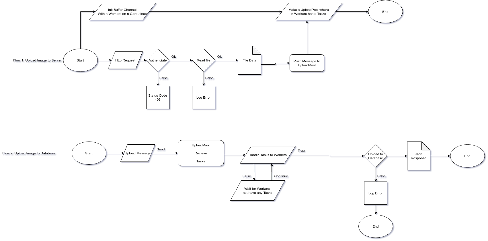

# What We Optimize Upload Images

## Use Goroutines
[Check Example Here](https://tour.golang.org/concurrency/1)

## An example Using Gin and Goroutines
[Click Here](https://github.com/gin-gonic/gin#goroutines-inside-a-middleware)

## How we Implement Goroutines to Our Upload API

